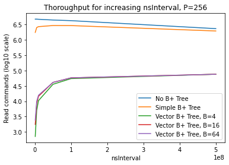
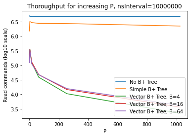

---
author:
- Marc Maliar
title: Offloading B+ Tree Insertion
---

# Introduction

Databases use the B+ tree data structure to store database records.
Databases then perform read and write operations on these stored
records. However, database write operations, or in other words B+ tree
insertion, can be expensive. So in workloads with a lot of writes, write
operations must be carefully optimized.

In some workloads, write operations come periodically in large chunks
which I call packets. The naive approach in dealing with these packets
is writing each of the records one-by-one into the existing B+ tree that
contains the database's records. However, as mentioned B+ tree insertion
is expensive, especially when the insertion forces the B+ tree to grow
and shift records around because it runs out of space. A database server
might end up disturbing the B+ tree several times when attempting to
write the records for just one of these packets. This will take away
valuable CPU time from read operations which are happening constantly
and at the same time. Furthermore, in this simplified model of a
database system B+ trees aren't necessarily parallelized well. So, a
packet operation which slowly writes records one a time will completely
lock out any read operations that should have been happening at the same
time.

One solution to this problem is to take this packet of records and just
put it into its own B+ tree. This will take a short amount of time and
read operations can resume immediately. Read operations will now have to
check the original B+ tree and this new temporary B+ tree as well when
searching for a new element.

When another packet comes, it also gets its own B+ tree. As more packets
arrive, at some point the database will have to merge the B+ trees
together for efficiency concerns: every new B+ Tree means that read
operations will have to search through an extra B+ tree when finding the
element they are looking for. This is not a big problem because B+ trees
are sorted so a merging algorithm is very efficient; we get the records
from two of these B+ trees, merge them together, then bulk-load them
into a new B+ tree. An easy way to formalize this merging is to have an
upper bound on total B+ trees (say 16), and then when we reach that
upper bound, merge every 2 B+ trees so we end up with 8.

# Implementation

## High-level overview

The program is coded in C++ and built using the meson build system. It
runs four threads at the same time: $client$, $source$, $writeServer$,
and $readServer$ threads.

$Source$ generates packets (records). It sends them to the
$writeServer$, which communicates with the B+ trees to add them there.

After sending a packet to the $writeServer$, $source$ also sends the
packet to the $client$. $Client$ takes that packet's records and stores
their IDs. Then it will issue read commands to the $readServer$. The ID
of the record that should be read is randomly picked from the $client$'s
stored IDs.

The $readServer$ and the $writeServer$ both interact with a B+ tree
wrapper object. The wrapper object actually stores a vector (list) of B+
trees as discussed. A read operation takes an ID and finds its record in
one of the B+ trees. A write operation takes a new packet, makes a new
B+ tree, bulk-loads the records into the B+ tree, and adds it to the
vector of B+ trees. If there are too many B+ trees, a merge will be
performed so that every two B+ trees become one. The B+ trees are
matched so that the one with the smallest size is merged with the one
with the largest size, and so on. To get the elements out from the B+
tree requires iterating through both B+ trees, storing the records in
two vectors, merging the vectors, bulk-loading the new records into a
new B+ tree, removing the original B+ trees, and adding the new B+ tree
in.

Packets are sent periodically, according to a timer. All threads have a
start time. Threads finish working when some amount of time passes,
usually one second. This is done by finding the difference between the
current time and the start time in nanoseconds, using the
$std::chrono::high \textunderscore resolution \textunderscore clock$.
$Source$, which sends the packages, sends one after a certain time
interval passes. $Client$, which sends read commands, never stops
sending read commands.

A read and write function call in the B+ tree wrapper object cannot
happen at the same time. We cannot be modifying or adding to the vector
of B+ trees while reading from it, and much less merging B+ trees
together. So, both methods are locked with a lock. The $writeServer$,
which will run the write method in the B+ tree wrapper object, waits as
much as needed to acquire the lock. We cannot have that we give up
writing a packet into the database. The $readServer$, on the other hand,
will try to acquire the lock in the read method, but if it fails it
gives up, and the read operation is counted as unsuccessful (does not
contribute to thoroughput).

Records have random $uint32 \textunderscore t$ IDs and a tiny payload
(also a $uint32 \textunderscore t$). It is worrying that two records may
end up with the same ID, but the B+ tree implementation that I use
allows multiple values to have the same key.

## Outside packages

The B+ tree code is located in the $btree.h$ file. It is part of the
TLX, \"a collection of C++ helpers and extensions universally needed,
but not found in the STL\" (<https://github.com/tlx/tlx>).

The threads send packets and read operations to one another using
MoodyCamel's ReaderWriterQueue
(<https://github.com/cameron314/readerwriterqueue>). This queue is
really fast and concurrent for one reader thread and one writer thread,
exactly as our program requires.

The $spinlock.h$ is a lock implementation found on StackOverflow (URL
reference not found). It is many times faster than $std::mutex$, which
as it turns out is extremely slow and takes as much as $0.3$ seconds to
lock and unlock, thus making nanosecond testing completely useless.
There are no $std::mutex$'s in the code now, only spinlocks.

## Testing framework

Currently, there are three tests located in the $test$ folder. The
first, called $id.cpp$, checks IDs of all the records in a packet, to
make sure they are generated randomly. The second, called $btree.cpp$,
checks that records inserted into a B+ tree can indeed be found inside
of it. The third, called $queue.cpp$ runs the entire program (all
threads) for $1$ second and records thoroughput. These are the
parameters of a run:

-   $nsLimit$: nanosecond limit,

-   $nsInterval$: nanosecond interval, how often packages are sent,

-   $packetQueueCapacity$, $commandQueueCapacity$, $idQueueCapacity$:
    ReaderWriterQueue capacity, not very important,

-   $P$: records per package, important,

-   $N$: payload size per package, not important,

-   $B$: max number of B+ trees before merging, and

-   $USE \textunderscore BTREE$: if disabled, the B+ tree wrapper
    object's read and write methods do nothing.

-   $SIMPLE$: if enabled, there is only one B+ tree in the wrapper
    object, and records are inserted one-at-a-time from incoming
    packets.

In each of the upcoming graphs, there will be three lines: no B+ tree
operations, simple B+ tree object, and vector B+ tree object. The x-axis
will be $nsInterval$, but I want to make sure the number of records
written stays the same, so I will adjust $P$, or records per package (if
interval increases twice, records per packet will increase twice). There
is also the option not to adjust $P$ for increase in $nsInterval$, and
also make the x-axis $P$ and not adjust $nsInterval$. The y-axis will be
packets processed in 1 sec (thoroughput). There may be more lines for
different $B$ (max number of B+ trees in vector). Each experiment will
be run $5$ times to decrease the variance. The scale will be a
log-scale.

# Experiments

## Hypotheses

### Case $1$: $nsInterval$ increases, $P$ increases

As $nsInterval$ increases, if we adjust $P$, this will have no effect on
No B+ Tree. It will also have no effect on Simple B+ Tree since time
given to reading will be about the same. It will increase Vector B+ Tree
because it will spend less time merging.

For very low values of $nsInterval$, there will be an overhead cost of
sending so many packages so often. This will impact all three lines.

No B+ Tree will have best performance. I do not see a realistic scenario
where paying upfront overhead cost of Simple B+ Tree will be bigger than
Vector B+ Tree's multiple B+ tree reading. Simple B+ Tree's thoroughput
will always be much higher than Vector B+ Tree's. At high $P$, this
difference may get a bit smaller.

Higher $B$ will probably decrease performance since reading several B+
trees will be so expensive. This is more expensive than merging more
often.

### Case 2: $nsInterval$ increases, $P$ does not increase

As $nsInterval$ increases, if we don't adjust $P$, this will increase No
B+ Tree, since there will be more time for reading. It will also
increase Simple B+ Tree since more reading and fewer records to insert.
It will also increase Vector B+ Tree because more reading.

Again, No B+ Tree will have best performance, and Simple B+ Tree will be
bigger than Vector B+ Tree. Vector B+ tree will probably be even further
behind than Simple B+ Tree compared to the first experiment, as more
records per package benefits Vector B+ Tree.

Again, higher $B$ will probably decrease performance since reading
several B+ trees will be so expensive. This is more expensive than
merging more often.

### Case 3: $P$ increases, $nsInterval$ does not increase

As $P$ increases, if we don't adjust $nsInterval$, this will decrease No
B+ Tree slightly, since generating packets takes CPU time. It will also
decrease Simple B+ Tree since more reading and fewer records to insert.
It will decrease (but to a smaller degree) Vector B+ Tree because bulk
loading and reading will be harder.

Again, No B+ Tree will have best performance, and Simple B+ Tree will be
bigger than Vector B+ Tree. Vector B+ tree will get closer to Simple B+
tree with more $P$.

Again, higher $B$ will probably decrease performance since reading
several B+ trees will be so expensive. This is more expensive than
merging more often.

## Resulting graphs

### Case $1$

Missing because no data points for $P$ and $nsInterval$ that \"mirror\"
each other's growth.

### Case $2$

### Case $3$

# Conclusion

It is clear that the Vector B+ Trees graph object performs much worse
than Simple B+ Trees object. It makes no sense that thoroughput
decreased for higher $nsInterval$ for No B+ Tree and Simple B+ Tree.
Otherwise, all the hypotheses matched up.
